# DineHub - Restaurant Ordering System
DineHub is a comprehensive restaurant ordering system built using Spring Cloud. It provides functionalities for both ordinary users and administrators to manage orders, users, menus, and more.

## Microservices
The system is composed of several microservices:

Eureka Server: Service registry for microservices.

Config Server: Centralized configuration management.

Account Service: Manages user accounts and authentication.

Menu Service: Handles menu management operations.

Order Service: Manages order information.

User Service: Manages user information.

## Database
DineHub utilizes MySQL as its database management system with the following tables:

t_admin: Stores administrator information.

t_menu: Contains menu item details.

t_order: Stores order information.

t_type: Holds information about menu item types.

t_user: Stores user information.

## Functionality
### For Ordinary Users:
Register an account.

Place orders.

View order status.

### For Administrators:
Add, delete, or edit users.

Manage order statuses (e.g., mark orders as completed).

Add, edit, or delete menu items.

## Getting Started
### Clone the Repository:
git clone https://github.com/wulitina/DineHub.git
### Set up Configuration:
Update configuration files in the Config Server according to your environment.
### Build and Run Microservices:
Build and run each microservice using Maven or your preferred build tool.

Ensure proper communication between microservices.

### Database Setup:
Create a MySQL database and import the provided schema.
### Run the Application:
Start the Eureka Server.

Start the Config Server.

Start all other microservices.

### Accessing the Application:
Access the application through the provided login interface.

Ordinary users can register and place orders.

Administrators can manage users, orders, and menus.

## Key Page Screenshot

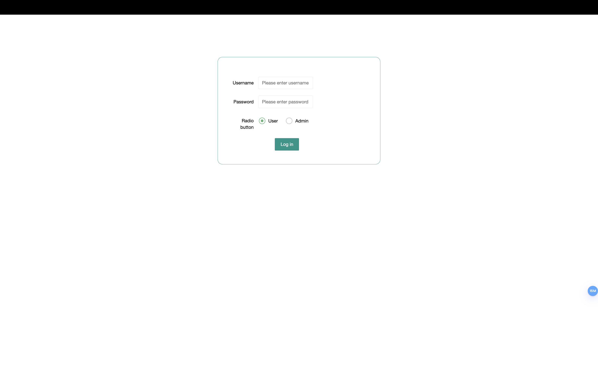

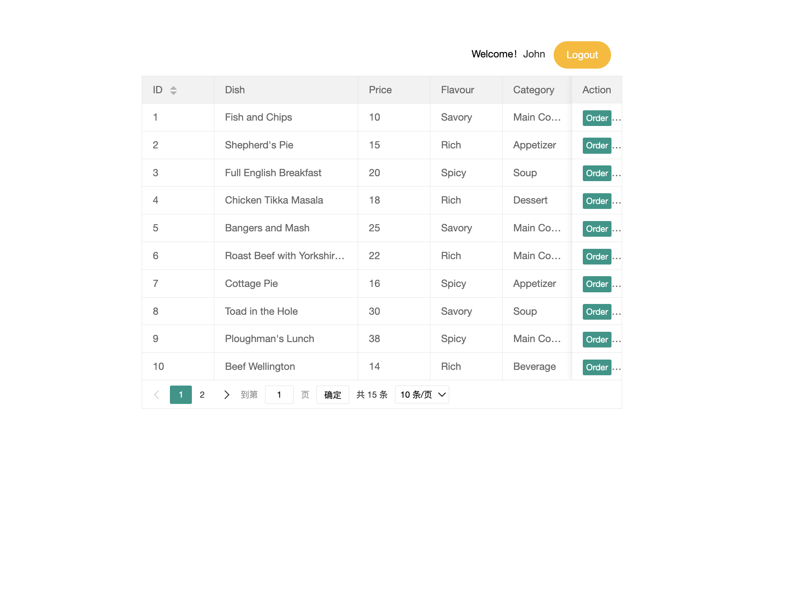

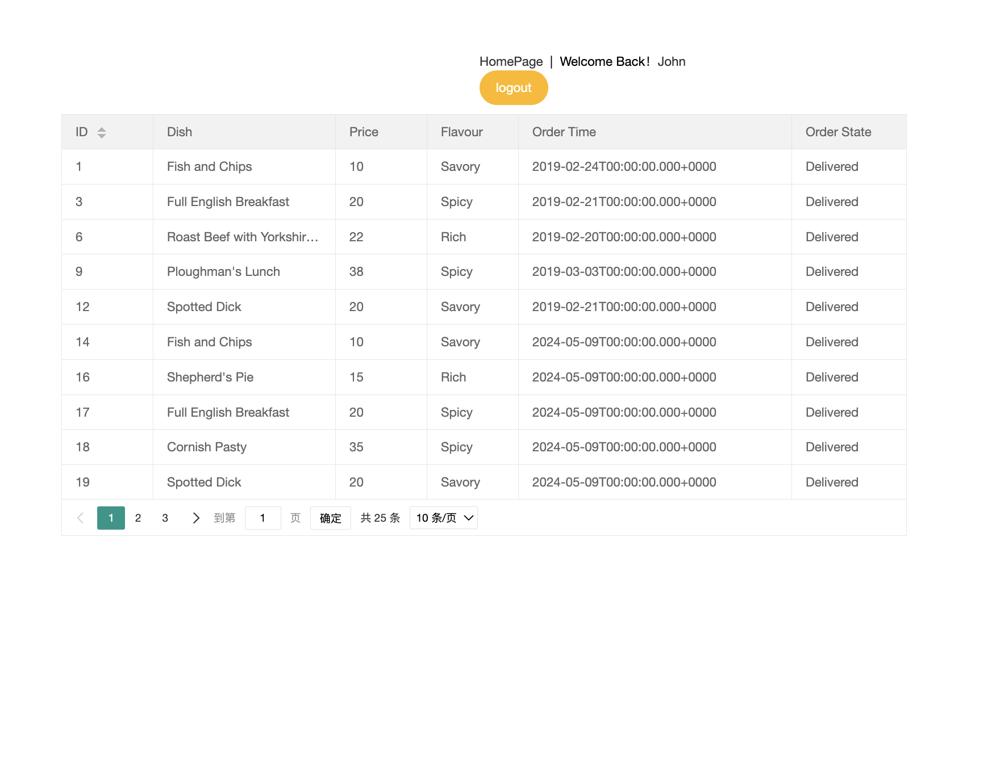

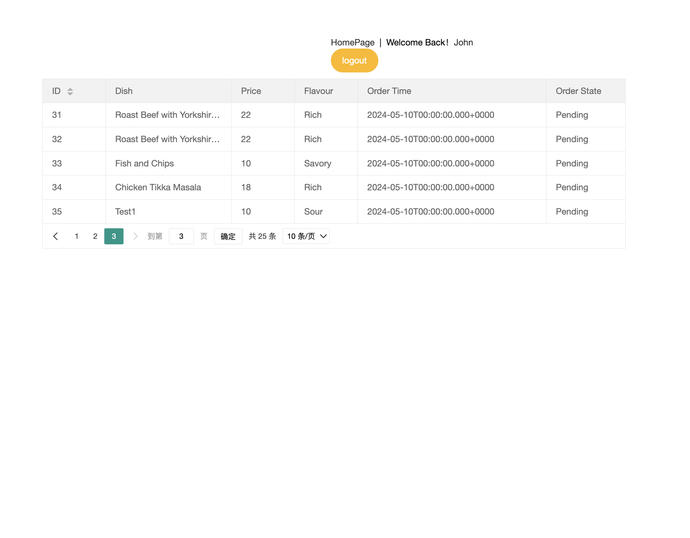

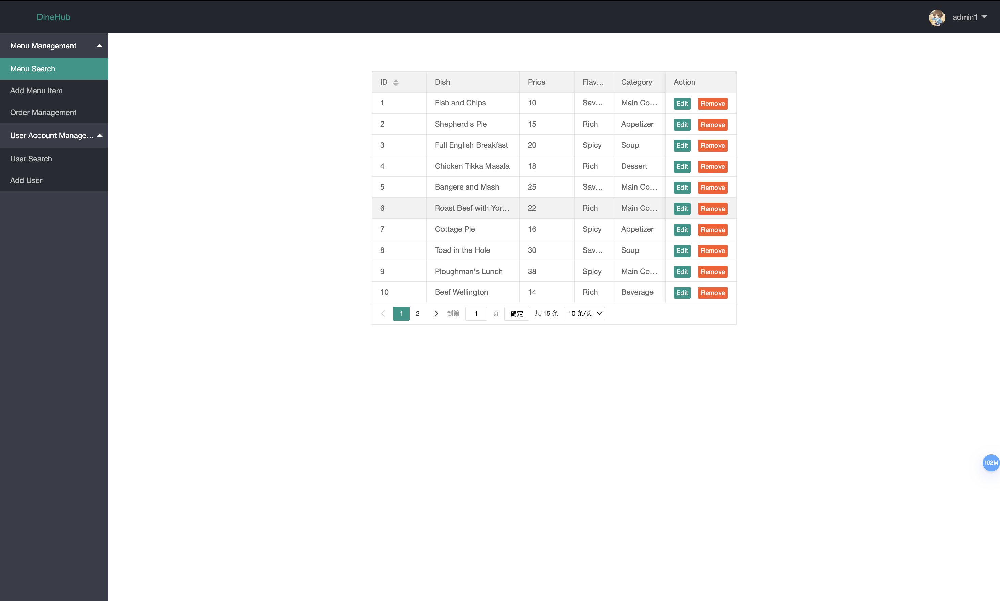

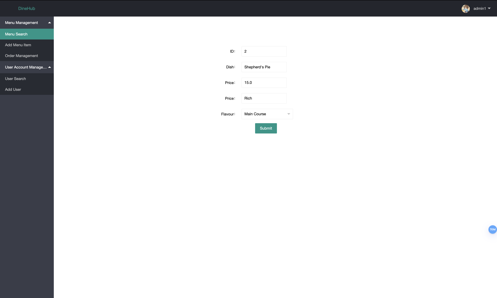

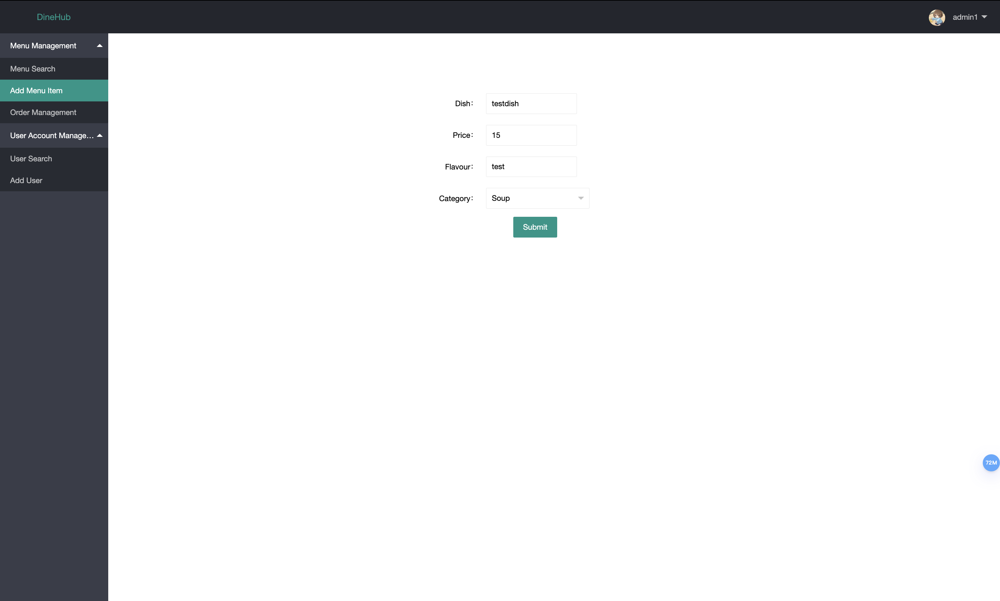

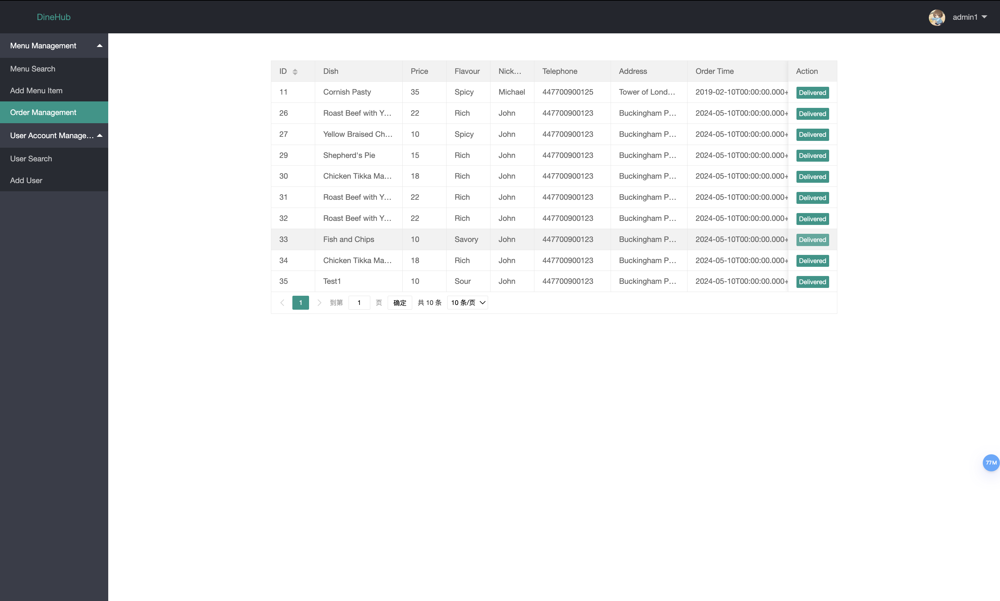

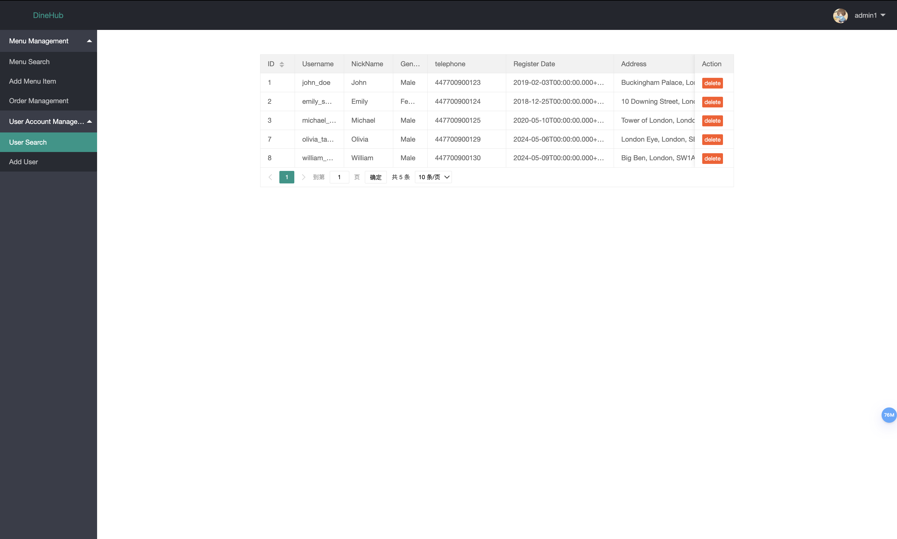

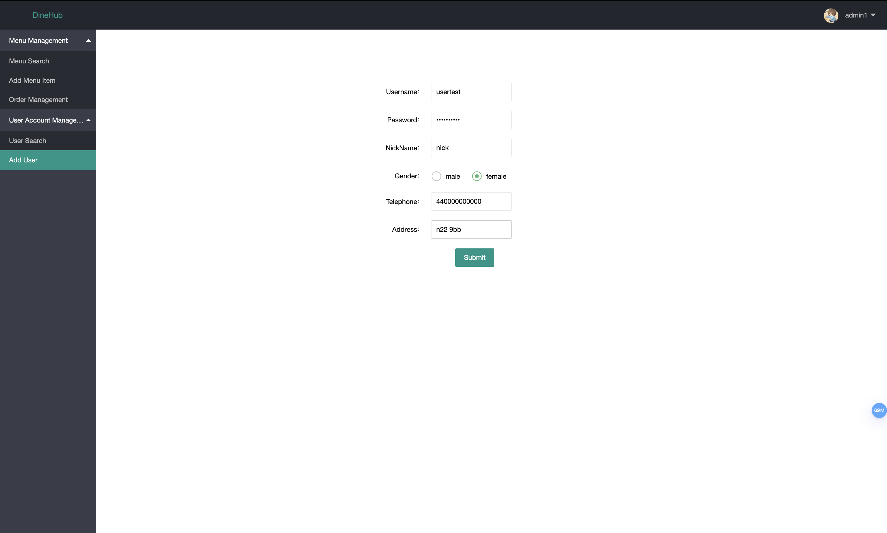

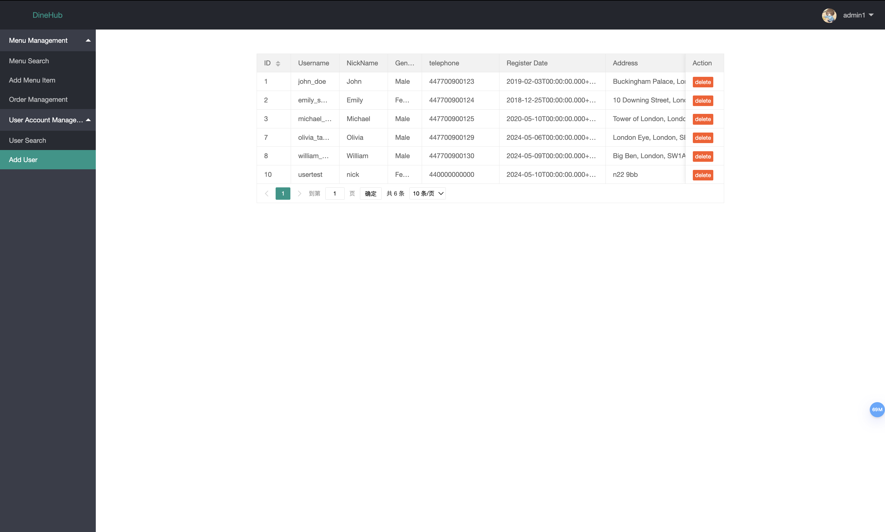

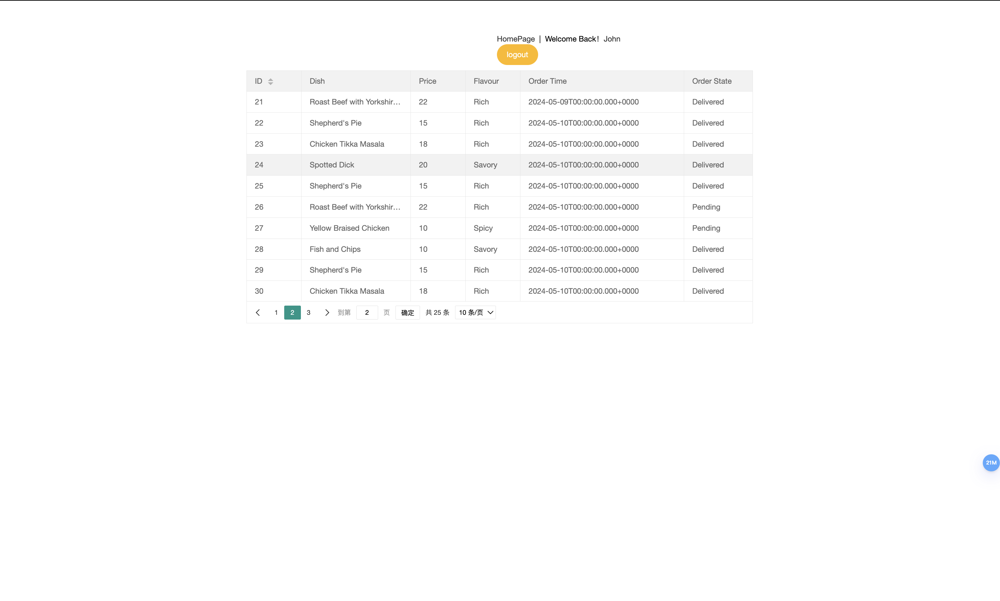

## Contributors
YanXu (Tina)
